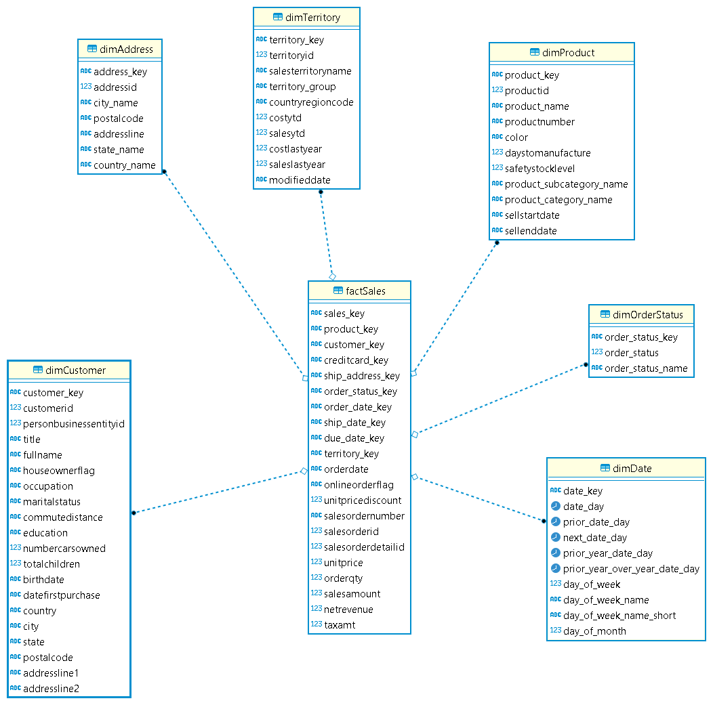
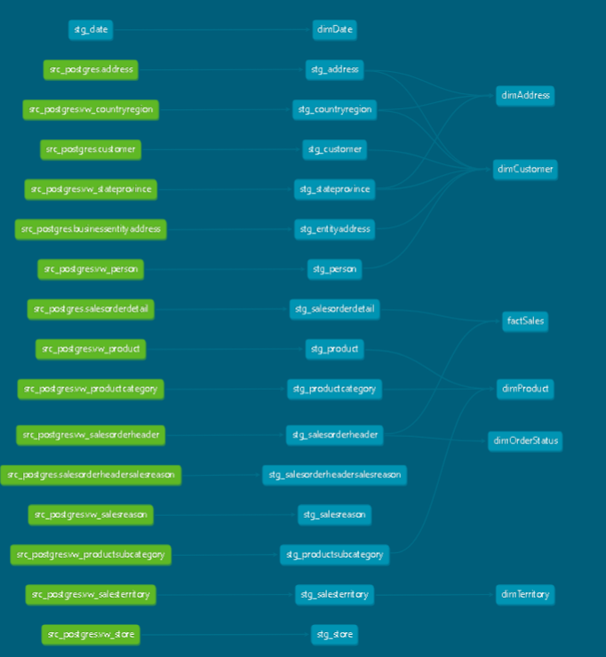

## Dimensional Modeling with AdventureWorks data using Modern Data Stack  

## Project Setup
You will need the following Tech Stack to run this project. 
- Dataset [AdventureWorks2019](https://learn.microsoft.com/en-us/sql/samples/adventureworks-install-configure?view=sql-server-ver16&tabs=ssms)
- EL tool [Airbyte]
- SQL Server
- PostgreSQL 
- Python 3.8 or above 
- dbt 1.4.5 or above
- dbt postgres plugin 1.4.5 or above

Using dbt we transform this data into dimensions and facts. 

## Source tables/views used from AdventureWorks database
| schema name 	| table name                   	| type  	|
|------------	|-----------------------------	|-------	|
| source     	| address                     	| table 	|
| source     	| businessentityaddress        	| table 	|
| source     	| customer                    	| table 	|
| source     	| salesorderdetail            	| table 	|
| source     	| salesorderheadersalesreason 	| table 	|
| source     	| salesorderheader            	| table 	|
| source     	| vw_countryregion            	| view  	|
| source     	| vw_product                  	| view  	|
| source     	| vw_productcategory          	| view  	|
| source     	| vw_person                   	| view  	|
| source     	| vw_store                    	| view  	|
| source     	| vw_salesreason              	| view  	|
| source     	| vw_salesterritory           	| view  	|
| source     	| vw_productsubcategory       	| view  	|
| source     	| vw_stateprovince            	| view  	|
| source     	| vw_salesorderheader          	| view  	|

## Dimensional Modeling 101
 The star schema is a particular way of organizing data for analytical purposes. It consists of two types of tables:
- A fact table, which acts as the primary table for the schema. A fact table contains the primary measurements, metrics, or ‘facts’ of a business process.
- Many dimension tables are associated with the fact table. Each dimension table contains ‘dimensions’ — that is, descriptive attributes of the fact table.

Below image is the representation of final Model after transforming the raw data with DBT

  

## Advantages of Dimensional Modelling
- Dimensional data modelling enables users to easily access data through simple queries, reducing the time and effort required to retrieve and analyze data.
- The simple structure of dimensional data modelling allows for faster query performance, particularly when compared to relational data models.
- Dimensional data modelling allows for more flexible data analysis, as users can quickly and easily explore relationships between data.
- Dimensional data modelling can improve data quality by reducing redundancy and inconsistencies in the data.
- Dimensional data modelling uses simple, intuitive structures that are easy to understand, even for non-technical users.
  These dimensional tables 'surround' the fact table, which is where the name 'star schema' comes from.

  ## DBT Completed DAG
  
Try running the following commands:
- dbt deps ( to run package dependencies)
- dbt test ( to check for data quality)
- dbt run ( to run and validate the models)
  
To view the Lineage 

- dbt docs generate
- dbt docs serve

### Resources:
- Learn more about dbt [in the docs](https://docs.getdbt.com/docs/introduction)
- Check out [Discourse](https://discourse.getdbt.com/) for commonly asked questions and answers
- Join the [chat](https://community.getdbt.com/) on Slack for live discussions and support
- Find [dbt events](https://events.getdbt.com) near you
- Check out [the blog](https://blog.getdbt.com/) for the latest news on dbt's development and best practices

